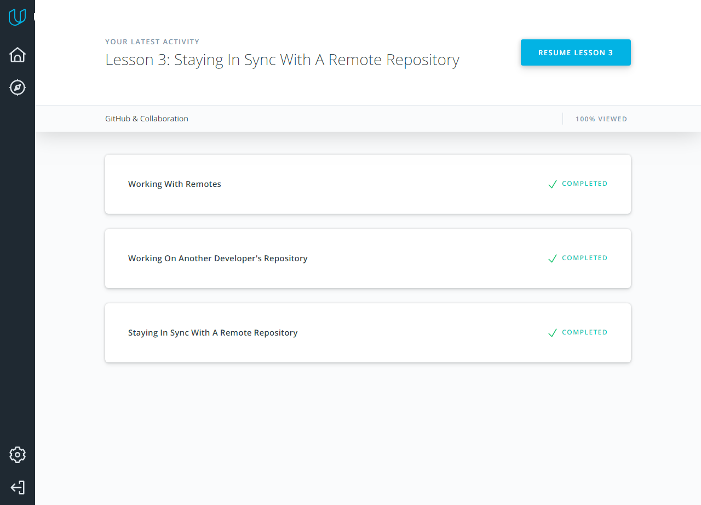
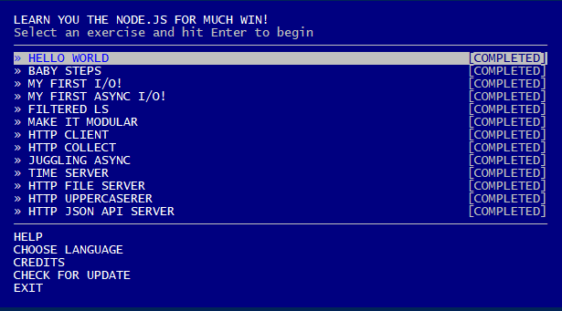
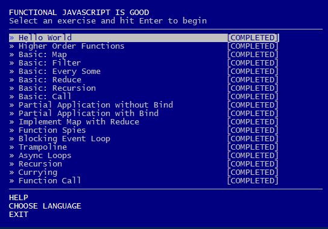
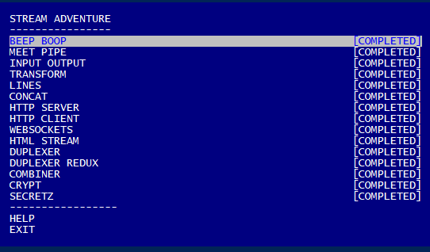

Though I was familiar with most of the material it was still very interesting to review it. I especially enjoyed the udacity git course.


## Unix shell


Making interactive tutorials was fun, but I knew already most of it's contents. Linuxcommand was actually much more fun. Especially I liked how a guy called Windows "legacy operating system" and "the other operating system" as if it was Lord Voldemort and you can't say its name.\
And I was also familiar with, but again amused by a weird way the bash shell defines function: with brackets just as a useless sintax marker and passing arguments as command line arguments. I am shure, there's a very good reason to make it like this, but it turnes reading function arguments into a tricky business.


## Git Collaboration




I was quite unfamilliar with forking and making pull requests, because I used git mostly for my own individual work. Also git rebase looks like a very powerfull tool which needs more looking into.

## NodeJS Basics 1







I was completely new to Node.js streaming and libraries, because used javascript before for frontend programming only. But the thing I was mostly impressed was the 'trampoline' template for a recursion. Recursion is a very powerfull conception, which really permits to solve some problems in a simple and elegant way, but it requires a lot of hardware resources for a stack of calls. The 'trampoline' thing removes that problem completely and I am absolutely intending to use it in future.

## Memory Management

If program reaches the maximul limit of stack there will be a stack overflow and the programm will receive a Segmentation Fault exception.

If programm requests a big memory allocation on heap, the block of memory will be created not on heap, but in the memory mapping segment.

Data memory segment stores the content of static variables, initialized in the source code. It is writable. Unlike data segment, text segment is not writable, but executable. It contains programm code and string literals.

```md
00400000-004f3000 r-xp 00000000 00:00 118527                     /bin/bash
004f3000-004f4000 r-xp 000f3000 00:00 118527                     /bin/bash
006f3000-006f4000 r--p 000f3000 00:00 118527                     /bin/bash
006f4000-006fd000 rw-p 000f4000 00:00 118527                     /bin/bash
006fd000-00703000 rw-p 00000000 00:00 0
0226c000-023ef000 rw-p 00000000 00:00 0                          [heap]
7f4cee590000-7f4cee59b000 r-xp 00000000 00:00 461187             /lib/x86_64-linux-gnu/libnss_files-2.23.so
7f4cee59b000-7f4cee59c000 ---p 0000b000 00:00 461187             /lib/x86_64-linux-gnu/libnss_files-2.23.so
7f4cee59c000-7f4cee79a000 ---p 0000000c 00:00 461187             /lib/x86_64-linux-gnu/libnss_files-2.23.so
7f4cee79a000-7f4cee79b000 r--p 0000a000 00:00 461187             /lib/x86_64-linux-gnu/libnss_files-2.23.so
7f4cee79b000-7f4cee79c000 rw-p 0000b000 00:00 461187             /lib/x86_64-linux-gnu/libnss_files-2.23.so
7f4cee79c000-7f4cee7a2000 rw-p 00000000 00:00 0
7f4cee7b0000-7f4cee7bb000 r-xp 00000000 00:00 461129             /lib/x86_64-linux-gnu/libnss_nis-2.23.so
7f4cee7bb000-7f4cee7bc000 ---p 0000b000 00:00 461129             /lib/x86_64-linux-gnu/libnss_nis-2.23.so
7f4cee7bc000-7f4cee9ba000 ---p 0000000c 00:00 461129             /lib/x86_64-linux-gnu/libnss_nis-2.23.so
7f4cee9ba000-7f4cee9bb000 r--p 0000a000 00:00 461129             /lib/x86_64-linux-gnu/libnss_nis-2.23.so
7f4cee9bb000-7f4cee9bc000 rw-p 0000b000 00:00 461129             /lib/x86_64-linux-gnu/libnss_nis-2.23.so
7f4cee9c0000-7f4cee9d6000 r-xp 00000000 00:00 461181             /lib/x86_64-linux-gnu/libnsl-2.23.so
7f4cee9d6000-7f4cee9d7000 ---p 00016000 00:00 461181             /lib/x86_64-linux-gnu/libnsl-2.23.so
7f4cee9d7000-7f4ceebd5000 ---p 00000017 00:00 461181             /lib/x86_64-linux-gnu/libnsl-2.23.so
7f4ceebd5000-7f4ceebd6000 r--p 00015000 00:00 461181             /lib/x86_64-linux-gnu/libnsl-2.23.so
7f4ceebd6000-7f4ceebd7000 rw-p 00016000 00:00 461181             /lib/x86_64-linux-gnu/libnsl-2.23.so
7f4ceebd7000-7f4ceebd9000 rw-p 00000000 00:00 0
7f4ceebe0000-7f4ceebe8000 r-xp 00000000 00:00 461293             /lib/x86_64-linux-gnu/libnss_compat-2.23.so
7f4ceebe8000-7f4ceebe9000 ---p 00008000 00:00 461293             /lib/x86_64-linux-gnu/libnss_compat-2.23.so
7f4ceebe9000-7f4ceede7000 ---p 00000009 00:00 461293             /lib/x86_64-linux-gnu/libnss_compat-2.23.so
7f4ceede7000-7f4ceede8000 r--p 00007000 00:00 461293             /lib/x86_64-linux-gnu/libnss_compat-2.23.so
7f4ceede8000-7f4ceede9000 rw-p 00008000 00:00 461293             /lib/x86_64-linux-gnu/libnss_compat-2.23.so
7f4ceedf0000-7f4ceefb0000 r-xp 00000000 00:00 461227             /lib/x86_64-linux-gnu/libc-2.23.so
7f4ceefb0000-7f4ceefb9000 ---p 001c0000 00:00 461227             /lib/x86_64-linux-gnu/libc-2.23.so
7f4ceefb9000-7f4cef1b0000 ---p 000001c9 00:00 461227             /lib/x86_64-linux-gnu/libc-2.23.so
7f4cef1b0000-7f4cef1b4000 r--p 001c0000 00:00 461227             /lib/x86_64-linux-gnu/libc-2.23.so
7f4cef1b4000-7f4cef1b6000 rw-p 001c4000 00:00 461227             /lib/x86_64-linux-gnu/libc-2.23.so
7f4cef1b6000-7f4cef1ba000 rw-p 00000000 00:00 0
7f4cef1c0000-7f4cef1c3000 r-xp 00000000 00:00 461022             /lib/x86_64-linux-gnu/libdl-2.23.so
7f4cef1c3000-7f4cef1c4000 ---p 00003000 00:00 461022             /lib/x86_64-linux-gnu/libdl-2.23.so
7f4cef1c4000-7f4cef3c2000 ---p 00000004 00:00 461022             /lib/x86_64-linux-gnu/libdl-2.23.so
7f4cef3c2000-7f4cef3c3000 r--p 00002000 00:00 461022             /lib/x86_64-linux-gnu/libdl-2.23.so
7f4cef3c3000-7f4cef3c4000 rw-p 00003000 00:00 461022             /lib/x86_64-linux-gnu/libdl-2.23.so
7f4cef3d0000-7f4cef3f5000 r-xp 00000000 00:00 189097             /lib/x86_64-linux-gnu/libtinfo.so.5.9
7f4cef3f5000-7f4cef3f9000 ---p 00025000 00:00 189097             /lib/x86_64-linux-gnu/libtinfo.so.5.9
7f4cef3f9000-7f4cef5f4000 ---p 00000029 00:00 189097             /lib/x86_64-linux-gnu/libtinfo.so.5.9
7f4cef5f4000-7f4cef5f8000 r--p 00024000 00:00 189097             /lib/x86_64-linux-gnu/libtinfo.so.5.9
7f4cef5f8000-7f4cef5f9000 rw-p 00028000 00:00 189097             /lib/x86_64-linux-gnu/libtinfo.so.5.9
7f4cef600000-7f4cef625000 r-xp 00000000 00:00 461023             /lib/x86_64-linux-gnu/ld-2.23.so
7f4cef625000-7f4cef626000 r-xp 00025000 00:00 461023             /lib/x86_64-linux-gnu/ld-2.23.so
7f4cef68d000-7f4cef825000 r--p 00000000 00:00 199538             /usr/lib/locale/locale-archive
7f4cef825000-7f4cef826000 r--p 00025000 00:00 461023             /lib/x86_64-linux-gnu/ld-2.23.so
7f4cef826000-7f4cef827000 rw-p 00026000 00:00 461023             /lib/x86_64-linux-gnu/ld-2.23.so
7f4cef827000-7f4cef828000 rw-p 00000000 00:00 0
7f4cef840000-7f4cef841000 rw-p 00000000 00:00 0
7f4cef850000-7f4cef851000 rw-p 00000000 00:00 0
7f4cef860000-7f4cef861000 rw-p 00000000 00:00 0
7f4cef870000-7f4cef871000 rw-p 00000000 00:00 0
7f4cef875000-7f4cef87c000 r--s 00000000 00:00 459579             /usr/lib/x86_64-linux-gnu/gconv/gconv-modules.cache
7fffd910f000-7fffd990f000 rw-p 00000000 00:00 0                  [stack]
7fffda0a4000-7fffda0a5000 r-xp 00000000 00:00 0                  [vdso]
```

Heap - 0226c000-023ef000, Stack - 7fffd910f000-7fffd990f000, MMS - 7f4cee590000-7f4cee59b000

New for me was the existance of memory mapping segment, different from the heap. I was surpised by the existance of memory leaks and need to prevent them in javascript — it appears than you should mind you memory allocation even if you write in a language with garbage collector.

## TCP. UDP. Network


I learned something new and was very surprised not by the lessons, but by something I've got to know while completing the coding tasks. It appears that there is absolutely, completely, literally no way in javascript to wait for a promice result in a sync code. So, I've spent some exciting time, making out how make proper promices from async funtions not returning promices and make them execute consequently. And I am positively shall use this in future;
